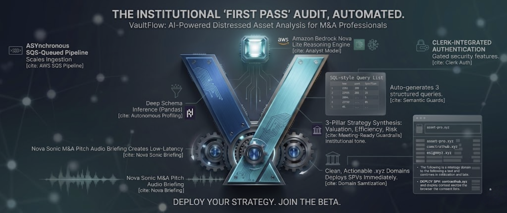
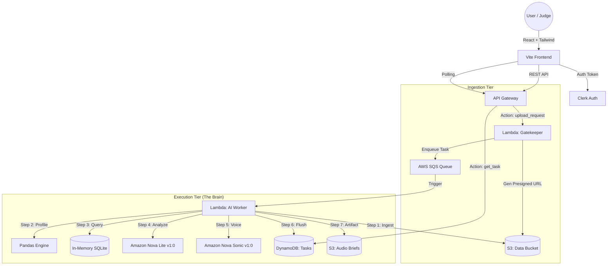

<div align="center">
  
  
  # VaultFlow: The Autonomous Micro-PE M&A Analyst
  <div align="center">
  
  <div style="background: #09090b; padding: 20px; border-radius: 12px; border: 1px solid #1e293b;">
    <h3 style="color: #22d3ee; margin: 0;">Autonomous M&A Pipeline</h3>
  </div>
  </div>  
  <br />

  **Built for the Orion Build Challenge 2026 (FinTech & Enterprise Systems)**
<div align="center">

  <a href="https://vauilt-flow.vercel.app/">
    
  </a>
  
  <a href="https://youtu.be/6Gamh6UfYyg">
    
  </a>

</div>
<br/>

  [](#)
  [](#)
  [](#)
  [](#)
</div>

<br/>

Micro-Private Equity is fundamentally broken. Finding distressed digital assets (Shopify stores, SaaS apps, Amazon FBA businesses) takes armies of analysts weeks of crunching messy P&L spreadsheets and financial ledgers. 

**VaultFlow collapses that entire timeline into seconds.** 

VaultFlow is a fully autonomous, 100% serverless M&A Analyst. Instead of manual auditing, it uses a self-healing **Amazon Nova Lite** Critic Agent to autonomously profile raw financial datasets, isolate distressed assets based on unit economic ratios (LTV:CAC), draft turnaround strategies, and instantly provision **.xyz domain names** to launch Special Purpose Vehicles (SPVs) for the acquisition.

---

### Why VaultFlow?

1. **Zero-Idle Infrastructure**: If no one is auditing a ledger, the AWS bill should be $0.00. The entire pipeline is built on AWS Lambda, API Gateway, and SQS for extreme cost-efficiency.
2. **Data Incineration**: Sensitive financial ledgers shouldn't live forever. Raw uploads are placed in ephemeral S3 storage with strict 24-hour lifecycle incineration policies to ensure data privacy.
3. **Self-Healing M&A Quant**: LLMs often struggle with complex financial math. Our Critic Agent intercepts SQL execution tracebacks in an isolated SQLite memory space, auto-correcting logic to ensure ratios like **LTV:CAC** and **Churn Decay** are calculated perfectly without crashing.
4. **The Killshot (Execution & Audio)**: Executives don't read dashboards—they listen to voice notes. VaultFlow streams a conversational **Amazon Nova Sonic** audio pitch directly to the client and dynamically generates the .xyz domains to legally house your new holding company.

---

## Architecture: The M&A Pipeline

Building an autonomous agent that handles financial state presents massive headaches: API timeouts and logic safety. VaultFlow uses a decoupled, asynchronous architecture to ensure reliability during heavy data profiling.



### 1. Beating the API Gateway Timeout (SQS Decoupling)

AWS API Gateway has a hard 29-second timeout. You can't profile a 50,000-row financial ledger and generate neural audio in under 29 seconds. The API Gateway acts as a bouncer: it validates the user session, generates pre-signed S3 URLs, and tosses the job into an SQS queue before returning a `202 Accepted` to the client.

### 2. The Ephemeral Sandbox

To isolate the execution of dynamic financial queries, we don't use a persistent database. When the Worker Lambda spins up, it mounts the raw ledger directly into an in-memory SQLite instance (`:memory:`). There is zero risk of data persistence leaks or SQL injection destroying core infrastructure.

### 3. The Critic Loop (Self-Healing Code)

If the AI draft of a complex M&A anomaly query fails, the Lambda catches the traceback. It feeds that exact error right back to Nova Lite as a "Critic" prompt, forcing the model to rewrite the logic. The user only ever sees the perfected result.

### 4. Neural Briefing & State Delivery

Once the math is settled, VaultFlow makes a final pass through Amazon Nova Sonic to generate the conversational executive brief. The final dashboard, including visual charts and .xyz domain suggestions, is delivered asynchronously to the React frontend.

---

## The Stack

* **Frontend**: React 19, Vite 6, Tailwind CSS v4, Plotly.js.
* **Auth**: Clerk.
* **Backend**: AWS API Gateway, Amazon SQS, AWS Lambda (Python 3.10), DynamoDB, Amazon S3.
* **AI Core**: Amazon Bedrock (Nova Lite v1.0, Nova Sonic v1.0).

## Local Development

### 1. Backend (AWS)
Deploy the Python handlers (`gatekeeper.py` and `worker.py`) to AWS Lambda.
* **Config:** 1024MB RAM minimum. 3-minute timeout.
* SQS must be set as the event source for the Worker Lambda.

### 2. Frontend (React)
```bash
git clone https://github.com/NemesisWaVe/VaultFlow.git
cd VaultFlow/frontend
npm install --legacy-peer-deps
```

Create a `.env` file:
```env
VITE_AWS_API_URL="your-api-gateway-url"
VITE_CLERK_PUBLISHABLE_KEY="your-clerk-key"
```

```bash
npm run dev
```
